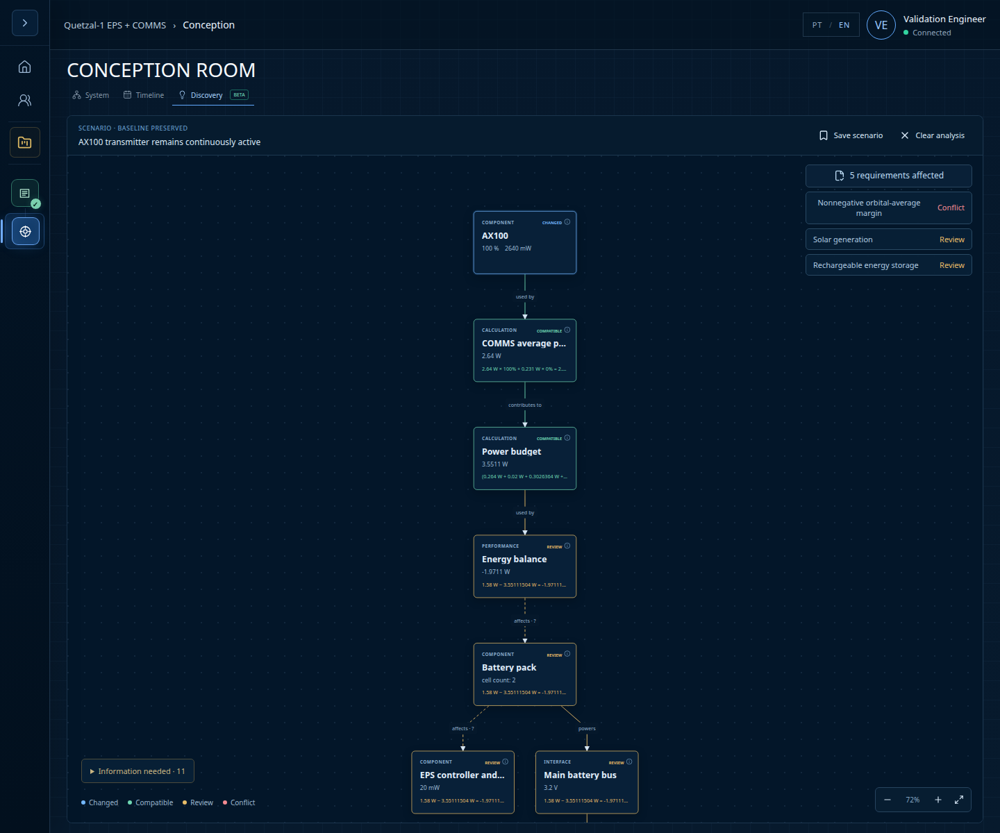

# Norte

Norte is an AI-assisted engineering workspace for understanding dependencies inside complex physical systems and exploring the impact of design changes.

[](https://github.com/Raiagues/norte/actions/workflows/ci.yml)
[](https://github.com/Raiagues/norte/actions/workflows/security.yml)
[](https://github.com/Raiagues/norte/actions/workflows/pages.yml)

## Official app

**[Official app](https://norte-missao.onrender.com/)** — the full application on Render with Neon PostgreSQL. The application page and [`/api/health`](https://norte-missao.onrender.com/api/health) were verified; the health endpoint reports PostgreSQL storage.

**[Frontend demo](https://raiagues.github.io/norte/)** — a separate GitHub Pages build with browser storage. It cannot run the private server-side document extraction service or share a production database.

## What Norte does

Project Memory connects a project's documents, files, links and team context. System presents an engineering baseline with typed entities, properties, dependencies and requirements. Discovery BETA is a space for testing hypotheses against that baseline.

The core interaction is a proposed change followed by its consequences: an altered component, the dependencies that need review, a compatible interface, or a concrete limit violation. Sources and calculation inputs stay accessible beside the engineering model.



*Design-context scenario: communications activity changes average demand. Source facts, calculations and unresolved mission requirements remain distinct; the baseline is preserved.*

## Current product state

| State | Scope |
| --- | --- |
| Implemented | Project Memory, account and team context, project persistence, timeline and freeform canvas navigation. |
| Beta | Automatic engineering-model extraction, System navigation, requirement traceability, auditable expert corrections, contextual what-if scenarios and a bounded deterministic impact engine. Extraction quality depends on the linked evidence. |
| Planned | Raw-artifact extraction benchmark, broader engineering rules, controlled promotion of scenarios to the baseline and independent engineering/student validation. |

New project and team creation are temporarily disabled in the interface. Fresh validation data contains one neutral team and **Quetzal-1 EPS + COMMS**, with curated design documents already attached and no reference competition. Its architecture is generated when conception starts. Generation failures never substitute a prebuilt model.

Norte is not a general physics simulator. An inferred dependency is a hypothesis for review. A deterministic result is limited to its inputs, units and explicit rule.

## Core workflow

1. Open the validation project and attach relevant sources in **Project Memory**.
2. Select **Start conception**. Norte reads the linked memory, builds and persists the initial engineering model, then opens **System**. Failed extraction can be retried after correcting the memory.
3. Inspect the macro architecture, focus a subsystem and open object information intentionally. Requirements are a separate layer linked to the architecture.
4. Propose a component, parameter or requirement change. Inspect the affected path, source facts and calculations. Corrections preserve the original suggestion, revised object, supporting evidence and context in exportable records.
5. Use **Discovery BETA** to write hypotheses. A recognized value change opens its impact with one contextual action; unresolved replacements retain a compact editor. Scenarios remain separate from the baseline.

## Architecture

- **Client:** React, TypeScript and Vite; Dagre for graph layout. Browser storage provides a local fallback.
- **Engineering model:** typed entities, properties with units, explicit relations, requirements, evidence and scenario records inside the project document.
- **Reasoning:** deterministic comparisons and graph traversal in ordinary code; Gemini handles conservative document extraction and assisted interpretation through the API.
- **API:** Fastify with schema validation, cookie sessions, CSRF protection, authorization and Swagger.
- **Storage:** atomic JSON locally; the same versioned state in transactional PostgreSQL when `DATABASE_URL` is configured.
- **Delivery:** GitHub Actions quality/security checks; GitHub Pages frontend demo; Render production service and Neon persistence.

See [architecture](docs/architecture.md), [product research and UX decisions](docs/PRODUCT_RESEARCH_ENGINEERING_REASONING.md) and [deployment](docs/deployment.md).

## Running locally

Use **Node.js 24.20.0 or newer**, as declared in `.node-version` and `package.json`.

```bash
git clone https://github.com/Raiagues/norte.git
cd norte
npm ci
cp .env.example .env
# Set GEMINI_API_KEY in .env to enable server-side extraction.
npm run dev
```

The launcher loads `.env` and `.env.local`, starts the client and API, and prints their addresses. It chooses the next available port when a preferred port is occupied.

| Service | Default URL |
| --- | --- |
| Web | `http://127.0.0.1:5173/norte/` |
| API | `http://127.0.0.1:8787/api` |
| Swagger | `http://127.0.0.1:8787/docs` |
| Health | `http://127.0.0.1:8787/api/health` |

Without `DATABASE_URL`, the API uses `var/mission-dev-data.json`. The first registered account becomes the owner/admin. Keep the local data file and backups private.

## Environment variables

| Variable | Purpose |
| --- | --- |
| `GEMINI_API_KEY` | Required for the private Gemini extraction/assistance service; never a `VITE_` variable. |
| `GEMINI_MODEL` | Gemini model; the current default is in `.env.example`. |
| `DATABASE_URL` | Optional PostgreSQL connection string; omit for local JSON storage. |
| `NORTE_API_HOST`, `NORTE_API_PORT` | API bind address and preferred local port. |
| `NORTE_WEB_PORT` | Preferred web port used by the development launcher. |
| `NORTE_ALLOWED_ORIGINS` | Comma-separated allowed browser origins. |
| `NODE_ENV` | Set `production` for the hosted API. |
| `PORT` | Hosted service port, supplied by Render. |
| `VITE_BASE_PATH` | Web base path: `/norte/` by default, `/` for Render. |
| `VITE_DEMO_MODE` | Enables the browser-only demo build when `true`. |
| `VITE_API_PROXY_TARGET` | Optional development proxy destination. |

The API reads its process environment. `npm run dev` loads local environment files for both processes. When starting the API separately, export the variables or run `node --env-file=.env server/index.mjs`.

## Development commands

```bash
npm run dev              # Client and API, loading local environment files
npm run dev:web          # Vite only
npm run dev:api          # API only
npm run typecheck
npm run lint
npm test                 # Vitest and Node API/engine tests
npm run test:api
npm run test:visual      # Isolated browser/API acceptance test (Chromium required)
npm run test:visual:quetzal # Seeded memory and hypothesis-to-impact interaction check
npm run benchmark:quetzal # Deterministic cases; extraction is evaluated separately
npm run benchmark:structural # Masked synthetic C2, with perturbed engineering values
npm run build
npm start                # API; also serves dist/ in production
```

## Testing and quality

```bash
npm run quality
npm run security:secrets
npm run security:audit
```

The browser acceptance test uses a temporary database and a mocked external extraction provider. Set `NORTE_CHROME` to your Chromium/Chrome executable if it is not detected by the default path. It does not change the local application database.

The quality gate runs TypeScript, ESLint, tests and the production build. CI additionally scans tracked files for secrets and audits dependencies. Security workflows run CodeQL and dependency review. The badges above report the real workflow status; no coverage percentage is claimed.

## Deployment

Render builds `dist/` and serves it alongside `/api` from one HTTPS origin. Configure its server-side `DATABASE_URL` and `GEMINI_API_KEY`. The blueprint declares deployment after checks and uses `/api/health`; the current service is deployed manually from the Render dashboard. GitHub Pages builds a distinct frontend demonstration and receives no API credentials. See [deployment instructions](docs/deployment.md).

## Validation

Fresh state contains **Norte Validation Team** and **Quetzal-1 EPS + COMMS**, with two curated context documents and no pre-generated system. The V0 scope uses design evidence from UVG's real spacecraft: EPS, communications and the electrical consumers needed for one power-budget operating point. It has no OBSAT association. Existing stored data is preserved during normal startup.

`benchmark/quetzal1/context/` is the model input. `evaluation_reference/` contains evaluator-only expectations and historical observations; it is never imported by the extraction service or client. Default evaluation runs deterministic cases using clean structured input, including the 25%/26% power-balance boundary. **A0** measures curated context → engineering model; raw-artifact extraction (**A1**) remains future work. To assess a separately generated extraction:

```bash
npm run benchmark:quetzal -- --prediction path/to/prediction.json
```

Reports under `var/benchmarks/` keep run manifests, per-case calculations, expected and predicted impacts, evidence and unsupported claims. A0 is reported as **not run** unless a prediction is supplied. A failed provider output remains a failed run; the curated model never substitutes for it.

Live checks use the server's configured provider and send only the allowed design context (extraction) or neutral questions without Project Memory (contamination probe):

```bash
node --env-file=.env.local scripts/extract-quetzal.mjs --runs 3 --evaluation-revision v0.1-development.1
node --env-file=.env.local scripts/probe-quetzal-contamination.mjs
```

Use the environment file where your server credentials are configured. The fixed contamination probe is metadata, not a benchmark score. C2 uses a separately authored neutral architecture and perturbed values; its deterministic result does not measure foundation-model generalization.

The user-approved [V0.1 validation specification](docs/VALIDATED.md) retains a separate requirement for independent engineering review, which remains pending. No public preflight snapshot was established, and model pretraining contamination cannot be ruled out. C1 is **historical causal reconstruction**, not an unseen-failure prediction. These are development results until review. See [sources, licenses, cases, metrics and reproduction](docs/VALIDATION_QUETZAL1.md).

The latest development checks passed nine deterministic cases. The six recorded live extraction attempts yielded no model approved under the final validation contract: evidence/hierarchy defects and provider HTTP 503/timeouts remain documented. Live extraction quality and availability still require validation; passing the browser fixture does not establish either.

To deliberately replace development/test projects, teams and associated workspaces, stop the API first and run:

```bash
NODE_ENV=development NORTE_ALLOW_DESTRUCTIVE_RESET=1 \
  node scripts/reset-validation-data.mjs --file var/mission-dev-data.json
```

The utility writes a private backup before replacement, preserves accounts and sessions, clears removed projects' Discovery state, and prints the verified counts. Restart the API afterward. The utility does not load `.env` implicitly or delete data on app startup.

For an explicitly local development/test PostgreSQL database:

```bash
NODE_ENV=test NORTE_ALLOW_DESTRUCTIVE_RESET=1 \
  node --env-file=.env.test scripts/reset-validation-data.mjs --database
```

This requires a loopback host and a database name containing a separate `dev`, `development` or `test` segment. Remote databases, production mode and Render environments are refused. The PostgreSQL reset takes a backup and updates the state in a transaction.

The browser demo exposes `resetDemoValidationData('RESET_VALIDATION_DATA')` from `src/lib/demoApi.ts` for an explicit validation reset. It backs up prior browser state and preserves the account profile. It is never called automatically. The [frontend validation guide](examples/README.md) also describes an explicit curated design preview for this browser-only environment; that preview is not an AI extraction result.

**Current technical measurements:** per-case dependency recall, critical-impact precision, calculation accuracy, unsupported-claim rate, traceability coverage and requirement-impact recall. Browser checks also record interaction count and local fixture timings. **Planned human evaluation:** task completion time, missed/false impacts, source lookups and decision confidence with documents versus Norte. Browser timings are not student study results.

## Security

Gemini credentials stay on the server. Artifact content is untrusted data, rendered as text, and cannot supply model instructions. External links are not fetched arbitrarily. Unsupported file formats must remain explicitly unparsed; missing evidence cannot justify an invented critical conflict.

The current hosted storage design represents a shared organization. Independent organizations need stronger tenant isolation before sharing one deployment. See [security policy](SECURITY.md).

## Repository structure

```text
src/pages/       Project Memory, conception and team screens
src/components/  Shared controls and engineering visualizations
src/lib/         Project model, reasoning, persistence and API clients
server/          Fastify API, AI services and data stores
scripts/         Development, security, validation and visual checks
tests/           Client/model tests
examples/        Explicit engineering examples and fixtures
benchmark/       Quetzal design context and separate evaluator-only expectations
docs/            Architecture, research and deployment notes
.github/         Quality, security and deployment workflows
```
